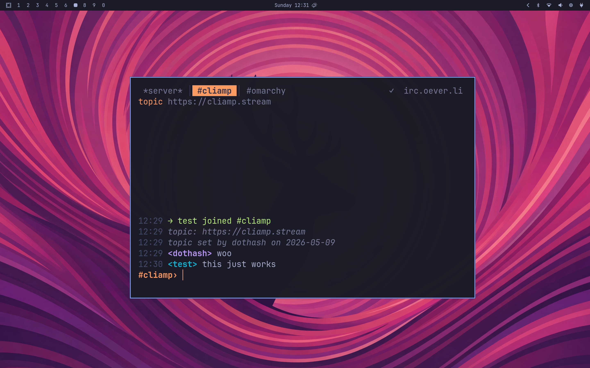

# coo

A light terminal IRC client built on Bubble Tea and Lipgloss.



Tabs across the top, channels open on demand, mouse and keyboard both work, themes load from TOML, and hostmasks never reach the screen.

## Quick start

```bash
go build -o coo .

./coo --server irc.oever.li --nick yourname '#omarchy'
```

Press `?` for the keymap, `Ctrl+T` for the theme picker, `/quit` to exit.

For NickServ or SASL login (password prompted at startup, never stored):

```bash
./coo --server irc.oever.li --nick yourname --sasl '#omarchy'
./coo --server irc.oever.li --nick yourname --nickserv '#omarchy'
```

For a persistent setup, drop a TOML file at `~/.config/coo/config.toml` and run `./coo` with no flags. See [docs/configuration.md](docs/configuration.md).

## Features

- 30+ slash commands: `/join`, `/msg`, `/whois`, `/who`, `/kick`, `/ban`, `/mode`, `/op`, `/away`, `/list`, `/notice`, `/ping`, and more. See [docs/usage.md](docs/usage.md).
- Mouse: click tabs to switch, click names to start a query, wheel-scroll the buffer.
- Scrollable modal overlays for the keymap (`?`), theme picker (`Ctrl+T`), and channel members (`/names`).
- 20 builtin themes plus user themes from `~/.config/coo/themes/*.toml`. See [docs/themes.md](docs/themes.md).
- Full CLI surface: every TOML key has a flag, and flags win. See [docs/configuration.md](docs/configuration.md).
- Hardened against malicious server input: ANSI escapes, mIRC color codes, BEL, and control bytes are stripped before display. Hostmasks (`nick!user@host`) are redacted from every nick we render. See [docs/architecture.md](docs/architecture.md).

## Install

### Arch Linux (AUR)

Two packages are published on AUR. Pick one:

```bash
# Source build (compiles locally with go)
yay -S coo
# or: paru -S coo

# Prebuilt binary (no go toolchain required)
yay -S coo-bin
# or: paru -S coo-bin
```

`coo-bin` provides `coo`, so installing one will conflict with the other. Pick the source package if you want to verify the build, the binary package if you want a one-second install.

### Build from source

```bash
git clone https://github.com/bjarneo/coo
cd coo
go build -o coo .

# optional: copy the binary onto your PATH
install coo ~/.local/bin/
```

Requires Go 1.25 or newer.

### Prebuilt binaries

One-liner that picks the right binary for your OS and arch, verifies the SHA-256, and drops it in `~/.local/bin` (or `/usr/local/bin` if `~/.local/bin` is not on your PATH):

```bash
curl -fSL https://raw.githubusercontent.com/bjarneo/coo/HEAD/install.sh | sh
```

Override the destination with `INSTALL_DIR=/some/path sh install.sh`. Or download manually from the [latest release](https://github.com/bjarneo/coo/releases/latest); Linux and macOS get amd64 + arm64, Windows gets amd64. Verify with the bundled `checksums.txt`.

## Documentation

- [Usage](docs/usage.md): slash commands, keybindings, mouse
- [Configuration](docs/configuration.md): CLI flags and `~/.config/coo/config.toml`
- [Themes](docs/themes.md): switching, customizing, and writing your own
- [Architecture](docs/architecture.md): codebase tour and security model

## Status

Single-network, foreground client. Works on Libera Chat, OFTC, Rizon, EsperNet, and any IRCv3-aware network.

Out of scope: DCC, multi-network, IRCv3 chathistory replay.

## License

MIT.
